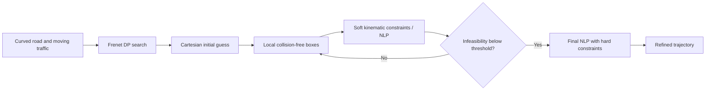

# Fast On-Road Trajectory Planning in the Cartesian Frame

**Use a coarse decision trajectory to initialize precise vehicle-motion optimization.** This repository contains the MATLAB/AMPL implementation of **“Fast Trajectory Planning in Cartesian rather than Frenet Frame: A Precise Solution for Autonomous Driving in Complex Urban Scenarios”**, published in *IFAC-PapersOnLine* in 2020.

Frenet coordinates are convenient for road-relative search, while Cartesian coordinates allow the vehicle's kinematics and collision geometry to be expressed directly. This planner combines both: the initial decision trajectory comes from a Frenet-frame DP search; the final trajectory is optimized in Cartesian coordinates.

## Method and implementation



`SpecifyLocalBoxes.m` constructs local position bounds for the vehicle's geometric representation. The first NLP relaxes kinematic equalities and measures their residuals, allowing repeated updates of the boxes and reference. Once the residual falls below the driver's threshold, `rr2.run` solves the final model with hard constraints.

The loop in `RunMe.m` allows up to six refinement iterations after its first solve and uses an infeasibility threshold of `0.01`. It stops with an error if refinement or the final solve fails; these checks are part of the actual execution path.

## Quick start

Use **MATLAB on Windows**, the protected `.p` helpers, and a working **AMPL/IPOPT** installation. Keep the original solver support files together and provide a valid AMPL license for the problem size. The model is passed to AMPL through files, so no MATLAB–AMPL API connector is needed.

```matlab
cd('C:/path/to/OnRoadPlanner_IFAC2020');
RunMe;
```

The figure shows the road and traffic scenario, with the coarse DP trajectory in **red** and the refined Cartesian trajectory in **green**. Run from the repository root so relative solver/input/output filenames resolve correctly. Generated optimization files are overwritten on subsequent runs.

## Files and functions

| File | Purpose |
| --- | --- |
| `RunMe.m` | Vehicle/environment settings, DP call, iterative optimization and final comparison plot. |
| `SearchDecisionTrajectoryViaDp.p` | Protected coarse trajectory search in the Frenet frame. |
| `ConvertFrenetToCartesian.p` | Protected coordinate conversion for road-relative states. |
| `GenerateObstacles.p` | Moving traffic setup. |
| `GenerateRoadBarrierGrids.p`, `ProvideRoadBound.m` | Road boundary generation and definition. |
| `DrawRoadScenario.p` | Protected scene visualization. |
| `FormInitialGuess.m` | Derive speed, acceleration, steering angle and steering rate from the coarse trajectory. |
| `SpecifyLocalBoxes.m` | Construct local bounds used to simplify collision constraints. |
| `WriteInitialGuessForFirstTimeNLP.m` | Write the first optimization warm start. |
| `WriteParameters.m` | Write horizon, discretization and terminal values. |
| `LoadStates.m` | Read optimized Cartesian states and the infeasibility measure. |
| `NLP.mod`, `rr.run` | Relaxed-kinematics optimization model and solve script. |
| `NLP2.mod`, `rr2.run` | Final hard-constraint model, solve and status export. |

## Default experiment

The search uses five 2 s time layers, seven longitudinal samples and eight lateral samples. Its 10 s coarse horizon is trimmed by `cutting_rate = 0.8`; the default optimized segment is therefore **8 s**, represented by **161 points** at 0.05 s spacing.

The default vehicle has a 2.8 m wheelbase and a 1.942 m body width. The script specifies bounds of 20 m/s for speed, 0.5 m/s² for acceleration, 0.7 rad for steering angle and 0.5 rad/s for steering rate. Five obstacle vehicles are generated with nominal speed 10 m/s.

Edit `RunMe.m` for experimental settings, `ProvideRoadBound.m` for road geometry and the model files for the optimization formulation. Keep coordinates, geometry and discretization consistent across the two planning stages.

## Citation

> Bai Li and Youmin Zhang, “Fast Trajectory Planning in Cartesian rather than Frenet Frame: A Precise Solution for Autonomous Driving in Complex Urban Scenarios,” *IFAC-PapersOnLine*, **53**(2), 17065–17070, 2020. [DOI](https://doi.org/10.1016/j.ifacol.2020.12.1549).

```bibtex
@article{Li2020CartesianPlanning,
  author = {Li, Bai and Zhang, Youmin},
  title = {Fast Trajectory Planning in Cartesian rather than Frenet Frame:
           A Precise Solution for Autonomous Driving in Complex Urban Scenarios},
  journal = {IFAC-PapersOnLine},
  volume = {53}, number = {2}, pages = {17065--17070}, year = {2020},
  doi = {10.1016/j.ifacol.2020.12.1549}
}
```

Please cite this paper when using the implementation or its Cartesian optimization method. Repository code is distributed under [GNU GPL v3](LICENSE); external solver components retain their own terms.
